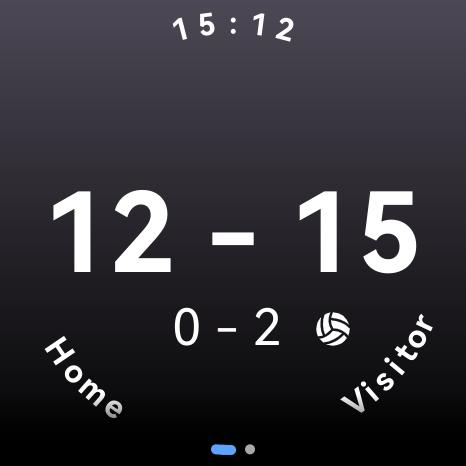
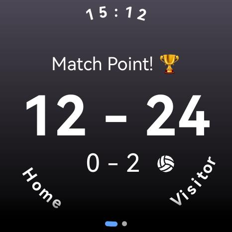
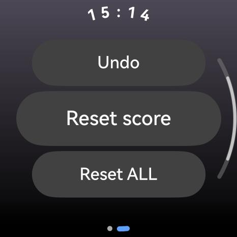

# Volleyball Score - HarmonyOS Next Wearable App

This is a HarmonyOS wearable app for tracking volleyball match scores on Huawei smartwatches.

## 🙏 Credit

This project was inspired by the original  
[Volleyball Score for Android Wear OS](https://github.com/RuiCunhaM/volleyball-wear-os) by [Rui C. Monteiro](https://github.com/RuiCunhaM).

## ✨ Features

- **Score Tracking:** Keep track of the score for two teams.
- **Set Tracking:** Track the sets won by each team.
- **Serving Indicator:** Indicates which team is currently serving.
- **Match Point Indicator:** Displays a "Match Point" message when a team is one point away from winning the set.
- **Haptic Feedback:** Provides vibration feedback when the score is updated.
- **Undo Functionality:** Undo the last score update.
- **Reset Functionality:** Reset the match or set scores.

## 📸 Screenshots

  
  

## 🛠️ Development Setup

To develop for HarmonyOS, follow these steps to set up your environment:

1. **Install DevEco Studio:**  
   Download and install the official IDE.  
   📖 [DevEco Studio Installation Guide](https://developer.huawei.com/consumer/en/doc/harmonyos-guides/ide-software-install)

2. **Set up the SDK:**  
   Use DevEco Studio to download and configure the HarmonyOS SDK.

3. **Clone the repository:**
   `git clone https://github.com/megaacheyounes/volleyball-harmonyos-wearable.git`

4. **Open the project in DevEco Studio.**

5. **Run on a device or emulator:**
   Use the built-in simulator or run on a Huawei Watch 5.

> 💡 Running on a physical device requires extra configuration. Follow the official guide:
> [Debugging your app (HarmonyOS)](https://developer.huawei.com/consumer/en/doc/app/agc-help-debug-overview-0000001955332054)

## 🚀 Releasing to AppGallery

To publish your app on Huawei AppGallery:

1. **Register as a Huawei Developer:**
   Sign up at the [Huawei Developer Portal](https://developer.huawei.com/consumer/en/) (it's free!).

2. **Create a new app in AppGallery Connect:**
   Fill in app info, like name and package ID.

3. **Build a signed release version:**
   Use DevEco Studio to create the release APK or HAP.

4. **Upload the release build to AppGallery Connect.**

5. **Submit for review:**
   After approval, your app will be published in the store.

## 📚 Resources

### DevEco Studio IDE

* **Purpose**: Official IDE for HarmonyOS development.
* **Docs**:

    * [Overview](https://developer.huawei.com/consumer/en/doc/harmonyos-guides-V5/ide-tools-overview-V5)
    * [Installation Guide](https://developer.huawei.com/consumer/en/doc/harmonyos-guides/ide-software-install-V13)

### HarmonyOS Next Wearable Development (ArkTS)

* **Purpose**: TypeScript-based development for HarmonyOS smartwatches.
* **Docs**:

    * [ArkTS Introduction](https://developer.huawei.com/consumer/en/doc/harmonyos-guides-V5/arkts-get-started-V5)
    * [ArkUI Overview](https://developer.huawei.com/consumer/en/doc/harmonyos-guides-V5/arkui-overview-V5)

### Huawei AppGallery Connect

* **Purpose**: Platform for app submission, signing, and release.
* **Docs**:

    * [Configure and Sign Release](https://developer.huawei.com/consumer/en/doc/harmonyos-guides/ide-publish-app#section6406135115814)
    * [Create Wearable App](https://developer.huawei.com/consumer/en/doc/app/agc-help-createharmonyapp-0000001945392297)
    * [Release App](https://developer.huawei.com/consumer/en/doc/app/agc-help-harmonyos-releaseapp-0000001914554900)

### Developer Forum

* **Purpose**: Technical support and discussions for wearable dev.
* **Link**: [Huawei Developer Forum](https://forums.developer.huawei.com/forumPortal/en/home?search=lite%20wearable)

## 📝 License

This project is licensed under the Unlicense.
See the [LICENSE](LICENSE) file for details.
